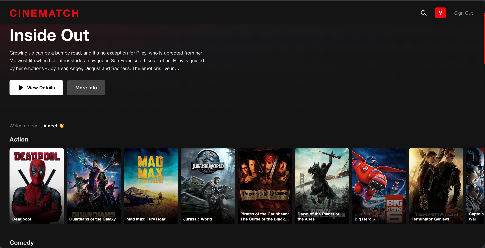
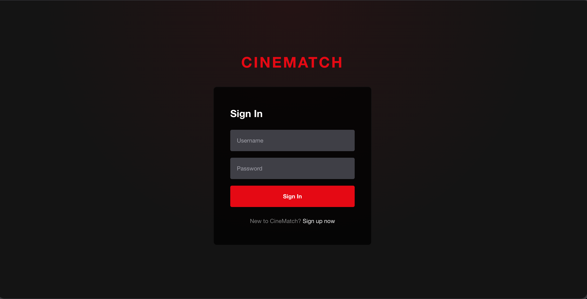
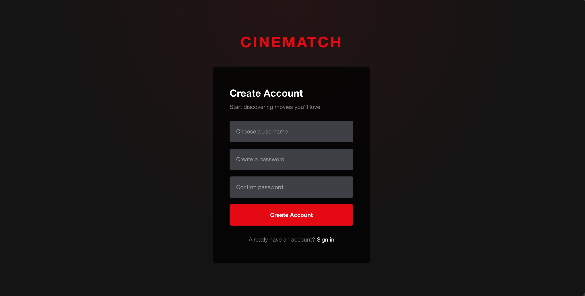
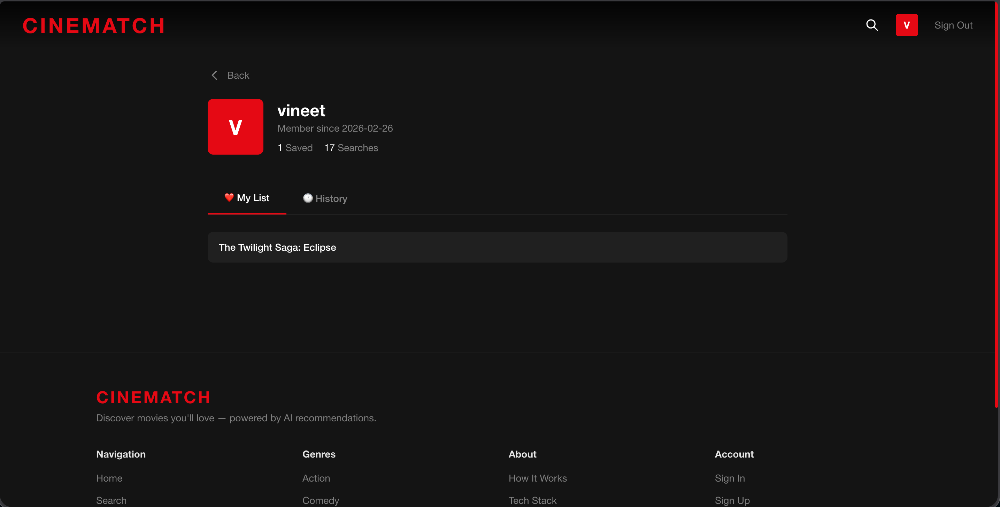
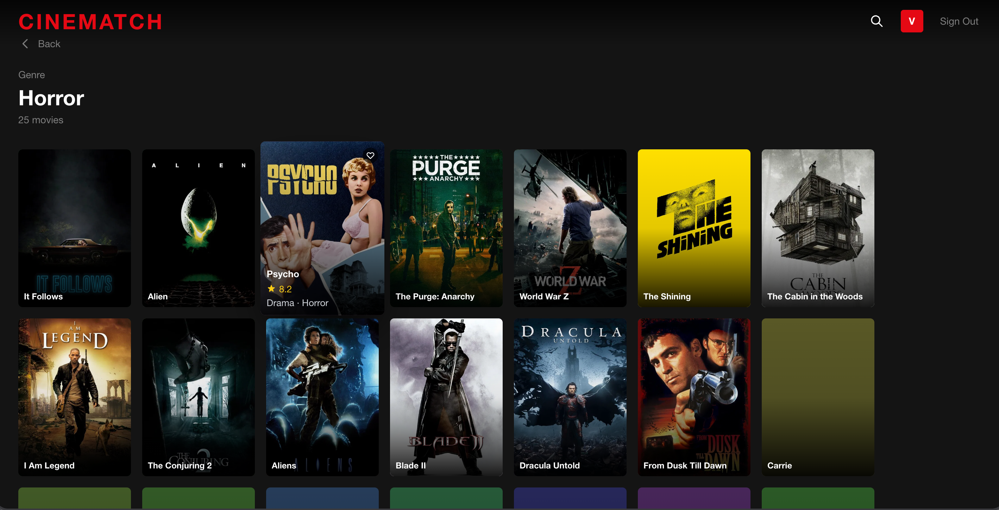

# CineMatch

CineMatch is a full-stack movie recommendation engine designed to provide personalized movie suggestions, manage user authentication, and track user preferences like favorites and watch history. The application consists of a FastAPI-powered backend and a React-based frontend.

## Features

### Backend

## Screenshots

Here are some screenshots of the CineMatch application in action:

### Home Page

_A view of the main browsing page with movie rows and a hero banner._

### Login Page

_The user login interface._

### Signup Page

_The user registration interface._

### Profile Page

_The user's personalized profile page._


### Genere Page

_A view of the Genere page with all movie ._


---Features


*   **User Authentication:** Secure signup and login using JWT.
*   **Movie Search:** Search for movies by various criteria.
*   **Personalized Recommendations:** Get movie recommendations based on user preferences and watch history.
*   **User Profiles:** Manage user information.
*   **Favorites & Watch History:** Add movies to favorites and track watched movies.
*   **Activity Logging:** Logs all incoming API requests for monitoring.

### Frontend
*   **Intuitive User Interface:** Built with React, offering a smooth user experience.
*   **Authentication Flows:** Login and Signup pages.
*   **Movie Browsing:** Home, Search, and Genre-specific movie listings.
*   **User Profile Management:** View and manage user profile.
*   **Protected Routes:** Ensures only authenticated users can access certain parts of the application.

## Technologies Used

### Backend (FastAPI)
*   **FastAPI:** Web framework for building APIs.
*   **Uvicorn:** ASGI server for running the FastAPI application.
*   **Python-Jose:** For JSON Web Token (JWT) handling.
*   **Passlib:** For password hashing.
*   **Python-Multipart:** For handling form data, if applicable.
*   **Pandas:** Data manipulation and analysis, likely for movie data processing.
*   **Scikit-learn:** Machine learning library, likely for the recommendation engine.
*   **Numpy:** Numerical computing, often used with Pandas and Scikit-learn.

### Frontend (React)
*   **React:** JavaScript library for building user interfaces.
*   **Vite:** Fast frontend build tool.
*   **React Router DOM:** For declarative routing in React applications.
*   **Axios:** Promise-based HTTP client for making API requests.
*   **Tailwind CSS:** A utility-first CSS framework for styling.
*   **PostCSS:** A tool for transforming CSS with JavaScript.
*   **Autoprefixer:** PostCSS plugin to parse CSS and add vendor prefixes.

## Setup and Installation

Follow these steps to set up and run CineMatch on your local machine.

### Prerequisites

*   Python 3.8+
*   Node.js (LTS recommended)
*   npm or yarn

### 1. Clone the Repository

```bash
git clone https://github.com/your-username/CineMatch.git
cd CineMatch
```

### 2. Backend Setup

Navigate to the `backend` directory, create a virtual environment, install dependencies, and set up environment variables.

```bash
cd backend
python3 -m venv venv
source venv/bin/activate  # On Windows, use `venv\Scripts\activate`
pip install -r requirements.txt
```

**Environment Variables:**
Create a `.env` file in the `backend` directory with necessary environment variables (e.g., `SECRET_KEY` for JWT).

```
# .env example
SECRET_KEY="your_super_secret_key_here"
ALGORITHM="HS256"
ACCESS_TOKEN_EXPIRE_MINUTES=30
```

### 3. Frontend Setup

Navigate to the `frontend` directory and install dependencies.

```bash
cd ../frontend
npm install # or yarn install
```

## Running the Application

### 1. Start the Backend Server

From the `backend` directory:

```bash
cd backend
source venv/bin/activate # On Windows, use `venv\Scripts\activate`
uvicorn main:app --reload
```
The backend API will be running at `http://localhost:8000`. API documentation will be available at `http://localhost:8000/docs`.

### 2. Start the Frontend Development Server

From the `frontend` directory:

```bash
cd frontend
npm run dev # or yarn dev
```
The frontend application will be running at `http://localhost:5173` (or another port if 5173 is in use).

## API Documentation

The backend API documentation is automatically generated by FastAPI and can be accessed at `http://localhost:8000/docs` once the backend server is running. This provides an interactive Swagger UI to explore all available endpoints.

## Project Structure

```
CineMatch/
├── backend/
│   ├── main.py                 # FastAPI application entry point
│   ├── auth/                   # Authentication logic (hashing, JWT)
│   ├── data/                   # Data files (e.g., movie_dataset.csv, users.json)
│   ├── engine/                 # Recommendation and search logic
│   ├── logs/                   # Application logs
│   └── routers/                # API endpoint definitions (auth, movie, user)
├── frontend/
│   ├── public/                 # Static assets
│   ├── src/
│   │   ├── api/                # API client (axios instance)
│   │   ├── components/         # Reusable React components
│   │   ├── context/            # React context for global state (e.g., AuthContext)
│   │   ├── pages/              # React pages (Home, Login, Profile, etc.)
│   │   ├── App.jsx             # Main React application component
│   │   ├── main.jsx            # React entry point
│   │   └── index.css           # Global styles
│   ├── index.html              # Main HTML file
│   ├── package.json            # Frontend dependencies and scripts
│   ├── tailwind.config.js      # Tailwind CSS configuration
│   └── vite.config.js          # Vite build configuration
├── requirements.txt          # Backend Python dependencies
└── README.md                 # Project README
```

## Contributing

Contributions are welcome! Please fork the repository and submit pull requests.

## License

This project is licensed under the MIT License. See the LICENSE file for details.
